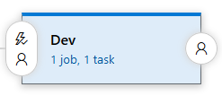
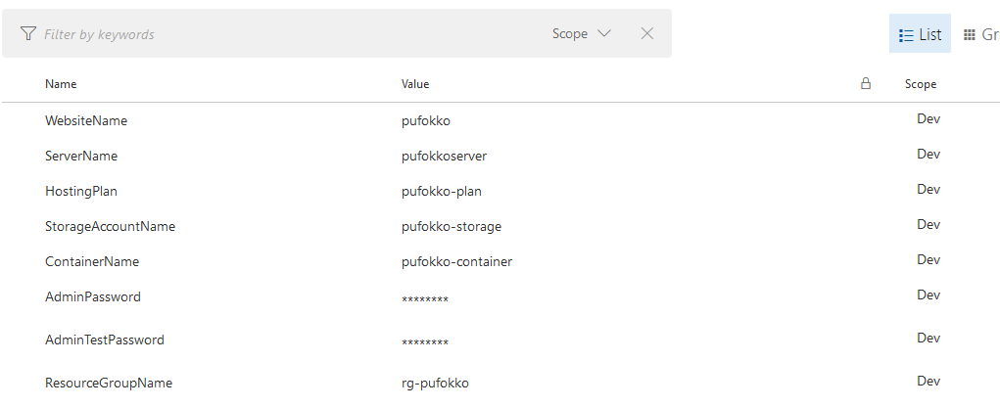

# Lab - Continuous Deployment with Release Management in Azure DevOps

## Description

In previous labs, the application called PartsUnlimited, was committed to a Git repo in Azure DevOps, you have adopted the **Continuous Integration** practice and have created a build definition that builds the app and runs unit tests whenever code is pushed to the master branch. Now we are going to modify your existing release pipeline to enable continuous deployment of the application to an Azure Web App.

## Pre-requisites

## Task 1. Modify the Release Pipeline for the Parts Unlimited Website

Initially the app will be deployed to a `dev` deployment slot.
The `staging` slot will require an approver before the app is deployed into it.
Once an approver approves the `staging` slot, the app will be deployed to the `production` site.

In this step, you will modify the Release Definition for the PartsUnlimited Website.
You'll use the CI build output as the input artifact for the Release and then define how the release moves through `stages` with approvals
in between.

### Step 1

In Azure DevOps, edit the release definition created in a previous lab. The template has a single Stage.

> A **Stage** is simply a logical grouping of tasks - it may or may not correspond to a set of machines.
For this Release Definition, you will create 3 Stages: **dev**, **staging** and **production**.

The infrastructure required for all 3 stages is described in the ARM Template.
The ARM Template will be applied during deployment in the Dev Stage before deploying the website to Dev.

### Step 2

Click the name label "Stage 1", a dialog appears at the right-hand side of the screen. Change the name to "Dev".

> You can also use a separate stage, for example called **setup infrastructure**, to execute the ARM deployment task.
> If you setup your Release Definition in this way, you can next create dev stage and clone this stage to staging and production
It will not be necessary to run any infrastructure tasks during Staging or Production deployments in this case.

### Step 3

Click on the **+ Add tasks** button to add a task for this stage.
In the "Deploy" group, click the **Add** button next to "Azure Resource Group Deployment" to add the task.
Close the "Task catalogue" dialog.

**Ensure that the Azure Resource Group Deployment task happens before the Deploy Azure App Service task. Otherwise there is no infrastructure to deploy the App Service to!**

### Step #4

Click on the "Azure Resource Group Deployment" task. Configure it as follows:

**First ensure that Version 1.* is selected for that task (pulldown menu at the right-hand top)**

> `Azure Subscription`: select the Azure subscription endpoint that you created earlier
>
> `Action`: select "Create or Update Resource Group"
>
> `Resource Group`: enter `$(ResourceGroupName)` into the box, you will create a variable named this shortly.
>
> `Location`: select an Azure location
>
> `Template location`: Linked artifact
>
> `Template`: click the "..." button and browse to the FullEnvironmentSetupMerged.json file in the ARMTemplates folder.

> `Template Parameters`: click the "..." button and browse to the FullEnvironmentSetupMerged.param.json file in the ARMTemplates folder.

> `Override Template Parameters`: Enter the following in a single line:

`-WebsiteName $(WebsiteName) -PartsUnlimitedServerName $(ServerName) -PartsUnlimitedHostingPlanName $(HostingPlan) -CdnStorageAccountName $(StorageAccountName) -CdnStorageContainerName $(ContainerName) -CdnStorageAccountNameForDev $(StorageAccountName)-dev -CdnStorageContainerNameForDev $(ContainerName)-dev -CdnStorageAccountNameForStaging $(StorageAccountName)-stage -CdnStorageContainerNameForStaging $(ContainerName)-stage -PartsUnlimitedServerAdminLoginPassword (ConvertTo-SecureString -String '$(AdminPassword)' -AsPlainText -Force) -PartsUnlimitedServerAdminLoginPasswordForTest (ConvertTo-SecureString -String '$(AdminTestPassword)' -AsPlainText -Force)`

You will shortly define the values for each parameter, like `$(ServerName)`, in the Stage variables.

> **Note**: If you open the FullEnvironmentSetupMerged.param.json file, you will see empty placeholders for these parameters. You could hard code values in the file instead of specifying them as "overrides". Either way is valid. If you do specify  values in the params file, remember that in order to change values, you would have to edit the file, commit and create a new build in order for the Release to have access the new values.

### Step #5

Click on the "Variables" tab to enter the Stage variables. Set the scope to Dev. Now the variables will only be available in the Dev stage.

### Step #6

Create the following variables, adding values too.

- **WebsiteName** - Name of the website in Azure
- **ServerName** - Prefix for the name of the database servers. Will have `-dev` or `-stage` added for dev/staging
- **HostingPlan** - Name of the hosting plan for the website
- **StorageAccountName** - Storage account name prefix. Will have `-dev` or `-stage` added for dev/staging
- **ContainerName** - Container name prefix. Will have `-dev` or `-stage` added for dev/staging
- **AdminPassword** - Admin password for production database server
- **AdminTestPassword** - Admin password for dev and staging database servers
- **ResourceGroupName** - Name of the Resource Group.

> **Note**: Use unique values for your variables by adding something custom at the end like your initials. Example for WebsiteName : pudncorejstr. Remember the name will be used for a global DNS entry, which should be globally unique.
>
> **Note**: You can hide passwords and other sensitive fields by clicking the padlock icon to the right of the value text box.

### Step #7

Save the definition.
Now that the infrastructure deployment is configured, we can modify the initial task.

### Step #8

Click on the Dev stage in the Release Definition and select the Dev stage Deployment process. The App Service Name is linked to the "AzureRM Web App Deployment" Task.

Enter `$(WebsiteName)` to use a variable. You defined this variable earlier when deploying
the ARM Template. You will shortly "promote" it to a Release variable so that it can be used in all Stages in the Release.

### Step #10

Now select the "AzureRM Web App Deployment" Task and check **Deploy to slot**.
Enter `$(ResourceGroupName)` into the Resource Group Box. Enter "dev" for the Slot. This will deploy the site to the "dev" deployment slot. This allows you to deploy the site to an Azure deployment slot without affecting the Production site.

### Step #11

Tick **Take App Offline** (in the **Additional Deployment Options** section). This stops the website for deployment period and takes it back online afterwards.
This is required because sites receive requests all the time causing files to lock down (i.e. making them unmodifiable).

### Step #12

Click the ellipsis (...) button, next to the "Package" box, to set the Web Deploy Package location. Browse to the PartsUnlimitedWebsite.zip file and click OK.

> **Note**: It is a good practice to run smoke tests to validate the website after deployment, or to run load tests. The code-base you are using does not have any such tests defined. You can also run quick cloud-performance tests to validate that the site is up and running. For more information on quick load tests, see [this video](https://channel9.msdn.com/Events/Visual-Studio/Connect-event-2015/Cloud-Loading-Testing-in-Visual-Studio-Team-Service) from around the 6 minute mark.

### Step #14

Promote the WebSite Stage variables to a Release Variables

Click on the "Variables" tab.
Variables can be defined on Release level and stage level.
Set the `WebsiteName` and `ResourceGroupName` variables scope to Release. This will make them available for all stages.

Click Save to save the Release Definition.

### Step #15

## Test the Dev stage with ARM Template Deployment

You will shortly clone the Dev Stage into both Staging and Prod stages.
However, before you do that it's a good idea to test that the Dev Stage is correctly configured by creating a new Release.

Before moving on, it is a good idea to test the template so far.

### Step #16

Click on "+ Release" in the toolbar and select "Create Release" to start a new release.

### Step #17

Select the latest build from the drop-down, and then select "Dev" as the target stage. Click "Create" to start the release.

### Step #18

Click the "Release-x" link to open the release.

### Step #19

Click on the Logs link to open and monitor the deployment logs.
You should see a successful release after a few minutes.

#### Step #20

Click on the Logs link to open the deployment logs.

### Step #21

If you log into the Azure Portal, you will see the Resource Group has been created.
You can check that the site was in fact deployed successfully by navigating to the site url.

> Since you deployed to the dev slot, you will need to navigate to `http://{siteName}-dev.azurewebsites.net` where siteName is the name of your Web App in Azure.

> By default you will only receive email notifications on failed release. This can be changed in settings for each stage. Click the ellipsis (...) on the Dev Stage card and select "Assign approvers..". Navigate to "General tab" and set the desired behavior.

## Clone the Dev stage to Staging and Production

Now that you have verified that the Dev Stage is configured correctly, you can clone it to Staging and Production.

### Step #22

Click on the PartsUnlimited link and then the Edit link to open the Release Definition.

> **Note:** It is possible to change the definition for a Release without changing the Release Definition (i.e. the Release is an instance of the Release Definition that you can edit). You want to make sure that you are editing the Release Definition, not a Release.

### Step #23

Hover the mouse cursor over the Dev Stage card and select "Clone" in the below right corner.

Click on the new stage and give it the name "Staging"

### Step #24

In the Dev Stage, you did not define any approvers. Click on the below blue circle to open de Pre-deployment conditions.

### Step #25

For Staging you should configure approvers. In "Pre-deployment approvals" section choose people who will approve deployments to the staging stage.

### Step #26

Delete the "Azure Resource Group Deployment" task. This is not required in this Stage since the ARM template deployed the infrastructure for all 3 stages.

### Step #27

Click on the Variables link (upper left) from the Release Definition.

### Step #28

Delete all the variables with the scope "Staging". These are used by the "Azure Resource Group Deployment" task which you just deleted, so they are not necessary in this Stage.

### Step #29

On the Azure App Service Deploy task, set the Slot to `staging`.

> **Note**: If you had stage-specific variables, you would be able to set Staging-specific values. It is not necessary in this case.

### Step #30

When we cloned dev to staging we set one person for staging's pre-approvals. We can adjust it even further by clicking the blue circles on the Staging Stage (two circles, with a people icon in it, one for pre-approvals and one for post-approvals). For this HOL, you can be both pre and post approver.

### Step #31

In this case, you want to pause the deployment coming in. This ensures that if someone is testing in the Staging stage,
they don't suddenly get a new build unexpectedly.

### Step #32

Clone the Staging stage to Production.
- Untick "Deploy to Slot" (i.e. the site will be deployed to the production slot).
- Update the approvers - again, you can be both approvers.

### Step #34

Save the Release Definition.

**Configure Continuous Deployment for this Release Definition**

### Step #35

Click on the Triggers link  of the build artifact of the Release Definition.

### Step #36

Set trigger to enabled.

> Selecting the build as the trigger means that any time the artifact build
completes, a new release will automatically start using the latest build.

### Step #37

Set "Stage triggers" to the following settings:
- Deployment to "Dev" stage should be triggered after release is created.
- Deployment to "Staging" can be triggered on successful deployment to "Dev".
- Deployment to "Production" can be triggered on successful deployment to "Staging".

> **Note:** Since the incoming build for this release is a CI build, you probably don't want to deploy the build all the way to Production. Setting the Release to stop at Dev means that you will need to create a new Release with Production as the target stage if you want to deploy to Production. This is of course configurable according to your own preference.

## Task 2. Trigger a Release.

Now that you have configured the Release Pipeline, you are ready to trigger a complete release.

With an Azure Service Endpoint to deploy to, and a package to deploy (from your CI build), we need to modify the Release Definition. 
The Release Definition defines how your application moves through the various Stages, including Tasks to update infrastructure, deploy your application, run scripts and run tests. 
You can also configure incoming or outgoing approvals for each Stage.

### Step #1

Click on "+ Release" to create a new Release.

### Step #2

Select the latest build, click Create.

> **Note**: You can adjust whether to deploy this release to a particular stage or change automatic deployment of a stage to manual if you wish to do so.

### Step #3

Once the Dev stage has completed deployment, you will see a notification that
an approval is pending (you will also have received an email notification if you ticked "Send an email notification to the approver whom the approval is pending on" option in settings for this stage).
Check the dev slot of the PartsUnlimited site in Azure to ensure that the Dev
stage is good, and then click Approve.

### Step #4

You can also see pending approvals in the overview pane:

### Step #5

Optionally enter a comment and click the Approve button.

### Step #6

This will trigger the release into the Staging stage.
> **Note**: You can reassign the approval if required.

### Step #7

Once the Staging deployment has completed, you will need to approve that staging is OK.

### Step #8

This will then trigger the pre-approval for Production. 
Once you've approved that, deployment into the Production stage will begin.

### Step #9

To see all your releases and where they are in their respective pipelines, click on All Releases and then click the Overview link.

## Congratulations!

You've completed this lab!

>**Note:** Deployment of schemas and data is beyond the scope of this lab. 
>It is recommended that you investigate <a href="https://msdn.microsoft.com/en-us/library/hh272686(v=vs.103).aspx"> SQL Server Data Tools (SSDT)</a> for managing database schema deployments.

## Further Reading

1. [Release Management in Azure DevOps](https://docs.microsoft.com/en-us/azure/devops/pipelines/release/what-is-release-management?view=azdevops)
2. [Cloud Load Testing in Azure DevOps](https://channel9.msdn.com/Events/Visual-Studio/Connect-event-2015/Cloud-Loading-Testing-in-Visual-Studio-Team-Service)

## Next Step
[Back to Labs overview](../../Readme.md).
