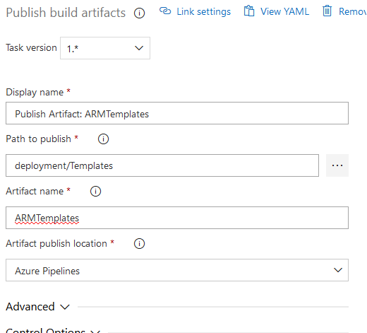
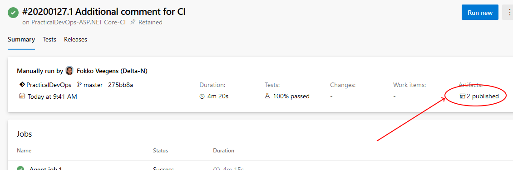

# Lab - Infrastructure as Code

In previous labs, you have created a Continuous Integration build definition that builds the PartsUnlimited application, and runs unit tests whenever code is pushed to the master branch. You have also set up a Release Pipeline using Release Management (a feature of Azure DevOps)
to be able to continuously deploy the application to an Azure Web App. In a later lab the app will be deployed using deployment slots, initially to a `dev` deployment slot. 
The `staging` slot will require and approver before the app is deployed into it. 
Once an approver approves the `staging` slot, the app will be deployed to the production site.

## Pre-requisites:

**Complete the [Continuous Integration Lab](../Continuous_Integration/LabDescription.md).**
This lab will setup the Continuous Integration (CI) build.

## Task 1: Explore the ARM Template to deploy the application infrastructure

Navigate to the **Repos** Hub and open the **deployment/Templates/FullEnvironmentSetupMerged.json** file, this file contains the full ARM template for the Parts Unlimited Application.
This file contains five sections: **$schema**, **contentVersion**, **parameters**, **variables** and **resources**
An ARM Template can also include a section called **outputs"", this section is not included in this case.

> **$schema** (required) defines the location of the JSON schema file that describes the version of the template language. Use the URL shown in the preceding example.
>
> **contentVersion** (required) contains the version of the template (such as 1.0.0.0). You can provide any value for this element. When deploying resources using the template, this value can be used to make sure that the right template is being used.
>
> **parameters** (optional) contains the values that are provided when deployment is executed to customize resource deployment.
>
> **variables** (optional) containes the values that are used as JSON fragments in the template to simplify template language expressions.
>
> **resources** (required) Resource types that are deployed or updated in a resource group.
>
> **outputs** (optional) the values that are returned after deployment.

Explore the **parameters**, **variables** and **resources** sections, understanding these sections will be useful in the continuous deployment lab.

## Task 2: Modify the CI Build to include the ARM Templates in Build Artifacts

In order to deploy to Azure, you're going to specify the infrastructure that the PartsUnlimited Website requires.
For example, the site requires an **Azure SQL Database** and an **Azure App Service Web App**.
Rather than create these by hand, we are going to use an Azure Resource Manager (ARM) template that describes this infrastructure in a json file.
This is a good DevOps practice, since you're describing **infrastructure as code**.

The source code repo already includes the infrastructure template required by the application (Infrastructure as Code). 
The code is a json file based on the Azure Resource Manager (ARM) template schema. 
You will use the template to deploy or update the infrastructure as part of the release.

The task that will deploy the **ARM template** will create the resource group if it does not exist. If the resource group does exist, then the template is used to update the existing resources.

> **Note:**
>
> The infrastructure described in the ARM templates for this lab will create resources that are **not free**.
>
> It creates an Azure Web App with 3 deployment slots.
>
> Deployment slots are only available with Standard or Premium App Service Plans. 
>
> They are **not** available on Free or Basic plans.
>
> Once you've completed this lab, **you probably want to delete the resource group in order to minimize charges to your Azure account.**

### Step 1

In your Azure DevOps Team project click on the **Pipelines** hub, and select Builds.

### Step 2

**Edit** the Build Definition that you configured in the Continuous Integration Lab.

### Step 3

Click **+ Add Task** and add a new "**Publish Build Artifacts** task

Configure it as follows:

* For `Path to Publish`, click the "..." button and browse to the deployment/Templates folder
* For `Artifact Name`, enter "ARMTemplates"
* For `Artifact publish location`, select "Azure Pipelines/TFS"

### Step 4

Save the updated build definition and queue a new build.

> **Note:**
>The build process may take a while, but there is no need to await its completion before proceeding. Come back and do the last step after task 3.

### Step 5

When the build has completed, verify that there are 2 folders: drop (which existed before) and ARMTemplates (new).

* The drop folder should contain a single file: PartsUnlimitedWebsite.zip (click **...** > **View contents** to view the contents)
* The ARMTemplates folder should contain a number of environment template and parameters JSON files.

## Task 3: Modify the ARM Templates to include the environment variables

In this task we modify the ARM template to include the ASP.NET environment setting as an environment variable.

### Step 6

Navigate to the code hub and open the file deployment\templates\fullEnvironmentSetupMerged.json

### Step 7

Find the following string in the file: **APPINSIGHTS_INSTRUMENTATIONKEY**
Use Ctrl-F to search for the string, use F3 for Find Next.

This string is present 4 times in the file.

The second location shows the following:

            "appSettingNames": [
              "APPINSIGHTS_INSTRUMENTATIONKEY",
              "Keys:ApplicationInsights:InstrumentationKey"
            ]

Change this to:

            "appSettingNames": [
              "ASPNETCORE_ENVIRONMENT",
              "APPINSIGHTS_INSTRUMENTATIONKEY",
              "Keys:ApplicationInsights:InstrumentationKey"
            ]

Find the next location of **APPINSIGHTS_INSTRUMENTATIONKEY**

This will show the following:

              "properties": {
                "APPINSIGHTS_INSTRUMENTATIONKEY": "[reference(concat('Microsoft.Insights/components/', parameters('WebsiteName'), '-DevInsights')).InstrumentationKey]",
                "Keys:ApplicationInsights:InstrumentationKey": "[reference(concat('Microsoft.Insights/components/', parameters('WebsiteName'), '-DevInsights')).InstrumentationKey]"
              }

Change this to:

              "properties": {
                "ASPNETCORE_ENVIRONMENT": "Development",
                "APPINSIGHTS_INSTRUMENTATIONKEY": "[reference(concat('Microsoft.Insights/components/', parameters('WebsiteName'), '-DevInsights')).InstrumentationKey]",
                "Keys:ApplicationInsights:InstrumentationKey": "[reference(concat('Microsoft.Insights/components/', parameters('WebsiteName'), '-DevInsights')).InstrumentationKey]"
              }

Find the last location of **APPINSIGHTS_INSTRUMENTATIONKEY**

This will show the following:

              "properties": {
                "APPINSIGHTS_INSTRUMENTATIONKEY": "[reference(concat('Microsoft.Insights/components/', parameters('WebsiteName'), '-StagingInsights')).InstrumentationKey]",
                "Keys:ApplicationInsights:InstrumentationKey": "[reference(concat('Microsoft.Insights/components/', parameters('WebsiteName'), '-StagingInsights')).InstrumentationKey]"
              }

Change this to:

              "properties": {
                "ASPNETCORE_ENVIRONMENT": "Staging",
                "APPINSIGHTS_INSTRUMENTATIONKEY": "[reference(concat('Microsoft.Insights/components/', parameters('WebsiteName'), '-StagingInsights')).InstrumentationKey]",
                "Keys:ApplicationInsights:InstrumentationKey": "[reference(concat('Microsoft.Insights/components/', parameters('WebsiteName'), '-StagingInsights')).InstrumentationKey]"
              }

Now commit the changes you have made.

## Congratulations

You've completed this lab!

[Back to Labs overview](../../Readme.md).
